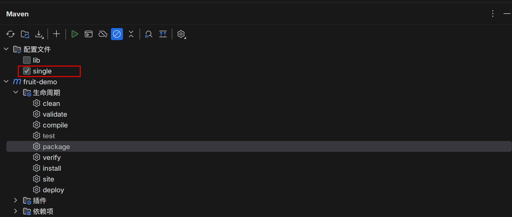
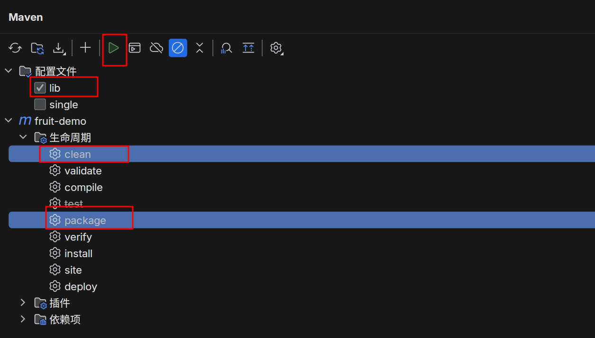

## 此项目自开发模板包项目
1. aPaaS私有化 3.0 版本对应分支 [3.0.0](https://git.dfy.definesys.cn/self-dev/self-developed-demo/-/tree/3.0.0)
2. aPaaS私有化 4.0 版本对应分支 [4.0.0](https://git.dfy.definesys.cn/self-dev/self-developed-demo/-/tree/4.0.0)
### mvn profile 简介
#### single 启动使用

1. 维护 `src/main/resources/application.properties`
2. 进入 src/main/java/com/xdap/fruit/FruitDemoApplication.java 点击启动
#### lib 打包使用

1. 如图所示，点击 ▶️ 按钮，进入项目target目录即可获取到待上传到aPaas平台的自开发包
